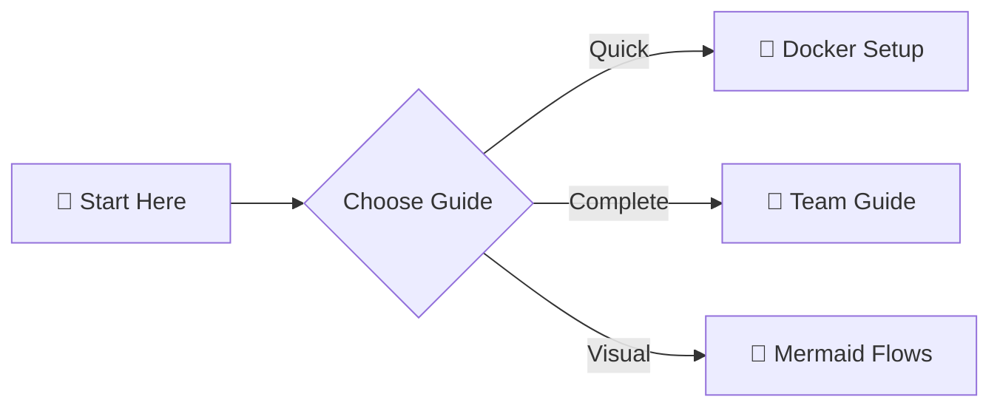

# 📚 Documentation

Welcome to the Cloud Security AI documentation!

---

## 🚀 Getting Started

**New to the project?** Start here:

1. **[README.md](./README.md)** - Project overview and quick start
2. **[Quick Reference](./QUICK_REFERENCE.md)** - Command cheat sheet

---

## 📖 Main Guides

### For Everyone
- **[README.md](./README.md)** - Project overview, architecture, and setup
- **[QUICK_REFERENCE.md](./QUICK_REFERENCE.md)** - All commands in one place

### For Developers
- **[TEAM_GUIDE.md](./TEAM_GUIDE.md)** - Complete developer guide
  - Running locally
  - Training models
  - VS Code setup
  - Google Colab workflows
  - Troubleshooting

### For Setup
- **[DOCKER_SETUP.md](./DOCKER_SETUP.md)** - Docker deployment (recommended)
- **[SETUP_GUIDE.md](./SETUP_GUIDE.md)** - Local development setup

### For Visual Learners
- **[DIAGRAMS.md](./DIAGRAMS.md)** - Interactive architecture diagrams
  - System architecture
  - Request flows
  - Docker setup
  - Training workflows
  - Decision trees

---

## 🎯 Quick Navigation

| I want to... | Read this |
|--------------|-----------|
| Start quickly | README.md → Quick Start |
| Use Docker | DOCKER_SETUP.md |
| Develop locally | SETUP_GUIDE.md |
| Join the team | TEAM_GUIDE.md |
| Find a command | QUICK_REFERENCE.md |
| Understand architecture | DIAGRAMS.md |
| Train a model | TEAM_GUIDE.md → Training |
| Deploy to cloud | README.md → Getting Started |

---

## 📊 Visual Guides

All documentation includes **Mermaid diagrams** that render beautifully on GitHub:



---

## 🛠️ Quick Commands

```bash
# Setup
make setup-dev          # Local setup
make docker-up          # Docker setup

# Running
make run-backend        # Backend
make run-frontend       # Frontend
make docker-logs        # View logs

# Training
cd backend && source venv/bin/activate && python train.py

# Deployment
make apply              # Deploy to OCI
```

---

## 📂 Project Structure

```
cloud-security-ai/
├── 📖 Documentation
│   ├── README.md            # Start here
│   ├── TEAM_GUIDE.md        # For developers
│   ├── DOCKER_SETUP.md      # Docker guide
│   ├── SETUP_GUIDE.md       # Local setup
│   ├── QUICK_REFERENCE.md   # Command reference
│   └── MERMAID_FLOWS.md     # Visual diagrams
│
├── 🏗️ Infrastructure
│   └── infra/               # Terraform files
│
├── 🐍 Backend
│   └── backend/             # FastAPI app
│
├── ⚛️ Frontend
│   └── frontend/            # React app
│
└── 🐳 Docker
    ├── docker-compose.yml   # Orchestration
    ├── Makefile            # Commands
    └── quick-setup.sh      # Automated setup
```

---

## 🆘 Need Help?

1. **Check the guide** - Most answers are in the documentation
2. **Run `make help`** - See all available commands
3. **Check logs** - `make docker-logs` or terminal output
4. **Read error messages** - They usually tell you what's wrong

---

## ✅ Documentation Quality

- ✅ Clear and concise
- ✅ Visual diagrams (Mermaid)
- ✅ Step-by-step guides
- ✅ Command references
- ✅ Troubleshooting sections
- ✅ Examples and code snippets

---

**Happy coding! 🚀**
