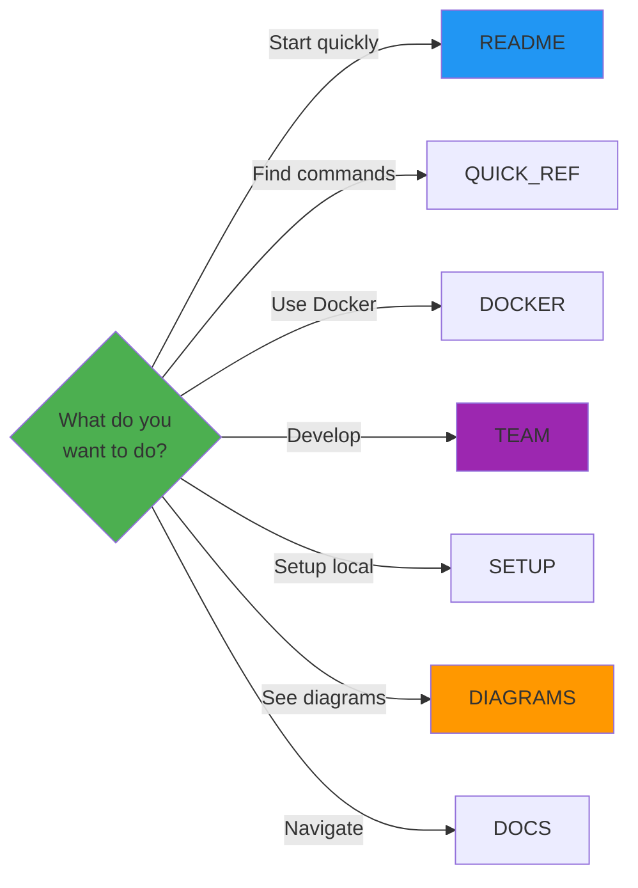

# 📚 Documentation Overview

```mermaid
graph TB
    Start[📖 New User] --> README[README.md<br/>Quick Start]
    
    README --> Choice{What Next?}
    
    Choice -->|Setup| Setup{How?}
    Choice -->|Learn| Learn[TEAM_GUIDE.md<br/>Full Guide]
    Choice -->|Commands| Quick[QUICK_REFERENCE.md<br/>Commands]
    Choice -->|Visual| Diagrams[DIAGRAMS.md<br/>Architecture]
    
    Setup -->|Docker| Docker[DOCKER_SETUP.md]
    Setup -->|Local| Local[SETUP_GUIDE.md]
    
    Docker --> Running[✅ Running]
    Local --> Running
    Learn --> Running
    
    Running --> Develop[Start Developing! 🚀]
    
    style Start fill:#4CAF50
    style README fill:#2196F3
    style Running fill:#9C27B0
    style Develop fill:#FF9800
```

---

## 📖 Core Documents

### 1. README.md ⭐
**The starting point for everyone**
- Project overview
- Quick start (Docker & Local)
- System architecture (Mermaid)
- Development workflow (Mermaid)
- Prediction flow (Mermaid)
- Getting started guide

### 2. DOCS.md 📚
**Navigation hub**
- Documentation index
- Quick navigation table
- File structure
- Getting help

### 3. TEAM_GUIDE.md 👥
**For developers**
- Complete workflows
- Running locally
- Training models
- VS Code setup
- Google Colab guide
- Troubleshooting

### 4. DOCKER_SETUP.md 🐳
**Docker deployment**
- Quick start
- Architecture diagram
- All Docker commands
- Troubleshooting

### 5. SETUP_GUIDE.md 💻
**Local development**
- Prerequisites
- Step-by-step setup
- Environment configuration
- Cloud deployment

### 6. QUICK_REFERENCE.md 📋
**Command cheat sheet**
- All commands
- Quick fixes
- File structure
- URLs and ports

### 7. DIAGRAMS.md 🎨
**Visual architecture**
- 14 interactive diagrams
- System architecture
- Request flows
- Workflows
- Decision trees

---

## 🎯 When to Use Which Guide

---

## ✨ Key Features

### Visual First
- 📊 Mermaid diagrams in README
- 🎨 14 diagrams in DIAGRAMS.md
- 🖼️ Renders on GitHub
- 💼 Professional appearance

### Easy Navigation
- 🚀 Clear starting point
- 🔗 Cross-referenced
- 📚 Documentation index
- 🎯 Purpose-driven

### Developer Friendly
- 💻 Complete workflows
- 🛠️ Command reference
- 🐛 Troubleshooting
- 🎓 Multiple setup options

### Hackathon Ready
- ⚡ Quick start
- 🐳 Docker support
- 📖 Clear documentation
- ✅ Professional quality

---

## 📊 Documentation Quality

| Aspect | Status |
|--------|--------|
| Clarity | ⭐⭐⭐⭐⭐ |
| Visual | ⭐⭐⭐⭐⭐ |
| Complete | ⭐⭐⭐⭐⭐ |
| Professional | ⭐⭐⭐⭐⭐ |
| Easy to Navigate | ⭐⭐⭐⭐⭐ |

---

## 🎉 Ready for Success

Your documentation is now:
- ✅ Clear and concise
- ✅ Visually appealing
- ✅ Easy to navigate
- ✅ Professional quality
- ✅ Hackathon-ready
- ✅ GitHub-optimized

**Push to GitHub and see the magic! 🚀**
