# 🎨 Visual Flow Diagrams (Mermaid)

These diagrams use Mermaid syntax and will render beautifully on GitHub, VS Code (with Mermaid extension), and many markdown viewers.

---

## 📊 System Architecture

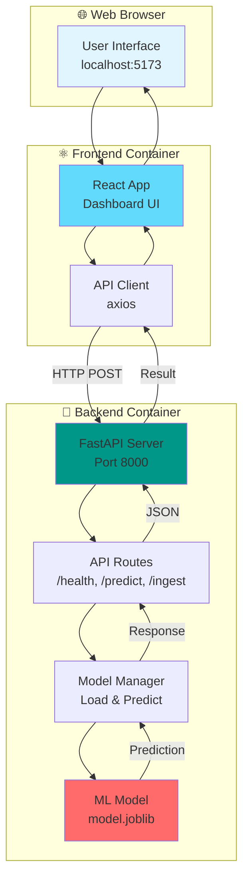

---

## 🔄 Prediction Request Flow

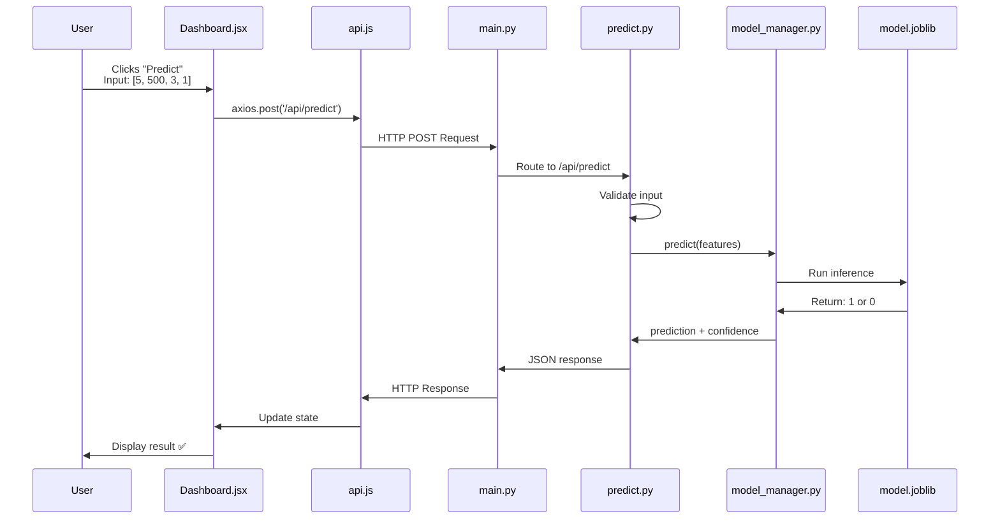

---

## 🐳 Docker Compose Architecture

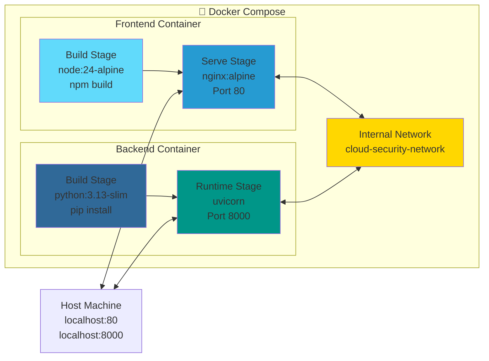

---

## 🚀 Development Workflow

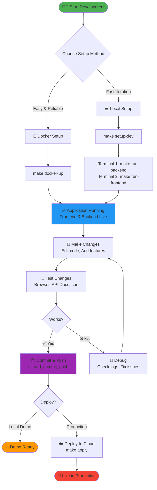

---

## 🤖 ML Model Training Flow

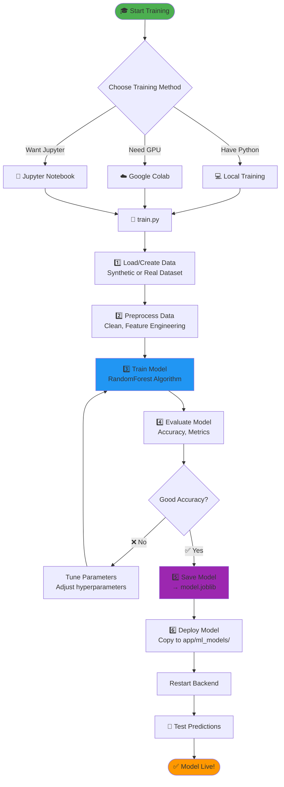

---

## ☁️ Cloud Deployment Flow

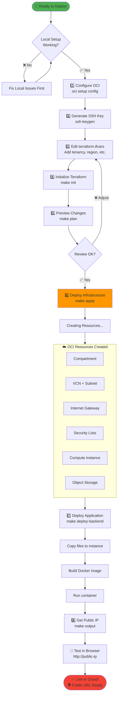

---

## 🔄 Git Workflow for Teams

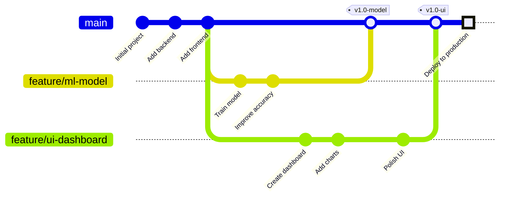

---

## 🧪 Testing Flow

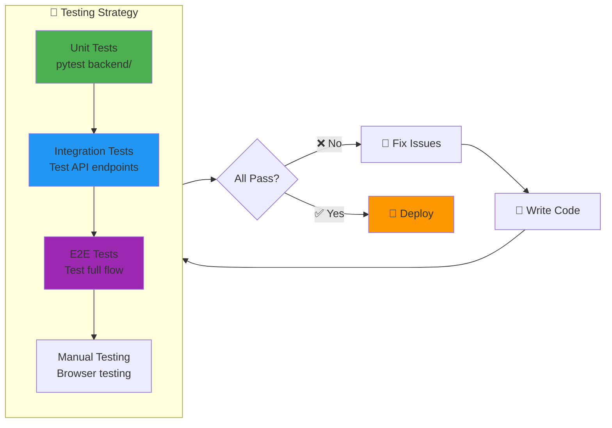

---

## 📦 File Dependency Graph

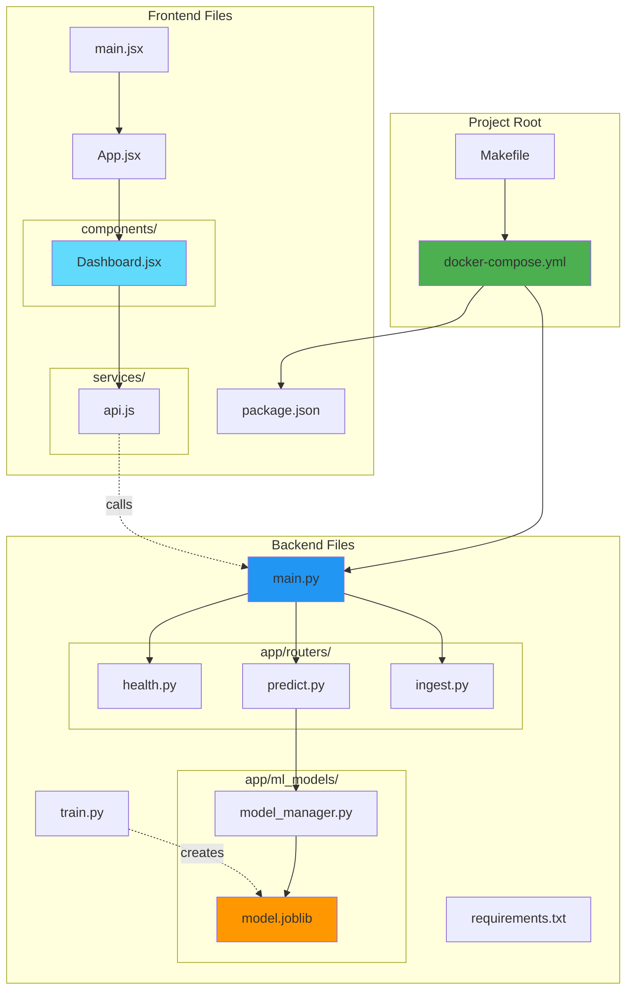

---

## 🎯 Decision Tree: Choose Setup Method

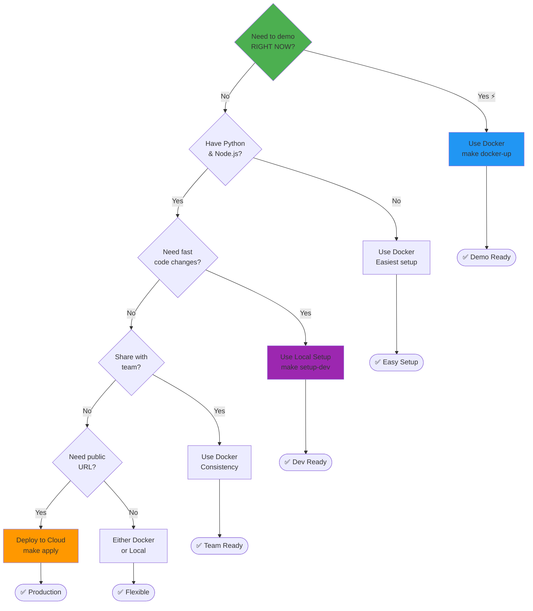

---

## 🔄 CI/CD Pipeline (Future)

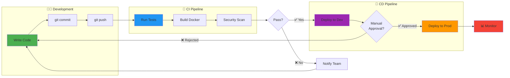

---

## 🎓 Learning Path

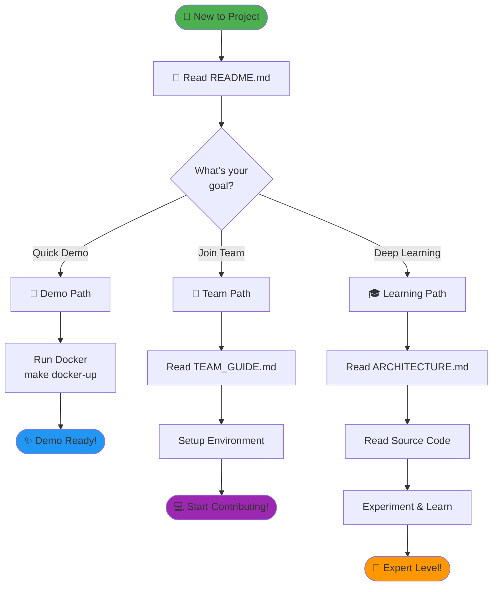

---

## 📊 Data Flow in the System

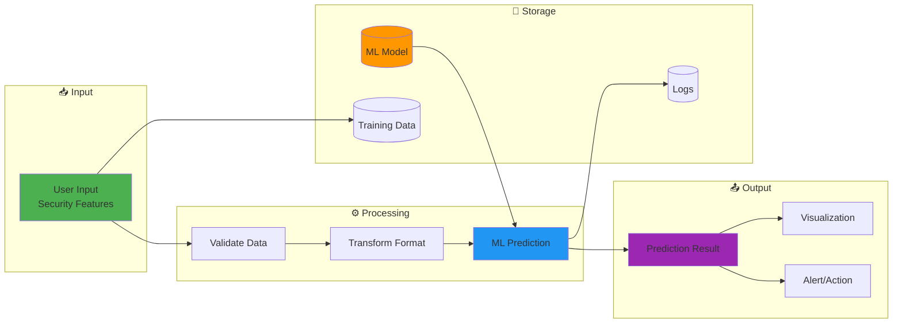

---

## 🔐 Security Flow (Future Enhancement)

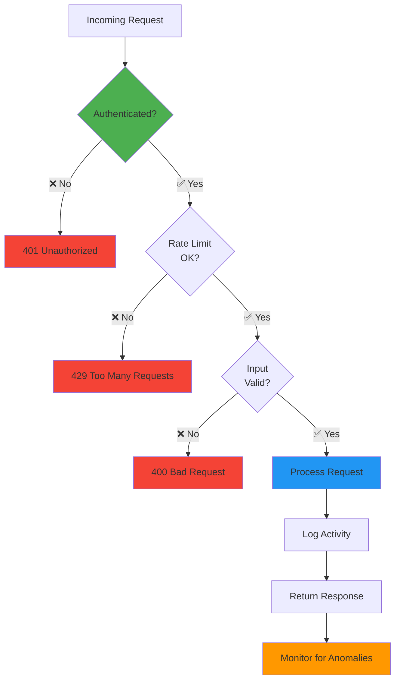

---

## 🎨 How to View These Diagrams

### On GitHub
✅ Automatically rendered - Just push to GitHub!

### In VS Code
1. Install extension: **Markdown Preview Mermaid Support**
2. Open this file
3. Press `Cmd+Shift+V` (Preview)

### Online Editors
- [Mermaid Live Editor](https://mermaid.live/)
- Copy any diagram and paste to edit/view

### Export Options
- PNG image
- SVG vector
- PDF document

---

**These diagrams make the architecture crystal clear! 🎯**
