# Cloud Security AI - Oracle Hackathon 2025

A complete hackathon-ready monorepo combining **AI/ML**, **Cybersecurity**, and **Oracle Cloud Infrastructure (OCI)**. This project demonstrates a full-stack cloud-native application with infrastructure as code, machine learning inference, and a modern web interface.

## 🚀 Quick Start (Choose One)

### Option 1: Docker (Recommended - Easiest)
```bash
git clone <your-repo-url>
cd cloud-security-ai
cd backend && python3 train.py && cd ..  # Train ML model
make docker-up                            # Start everything
# Open http://localhost
```

### Option 2: Local Development
```bash
git clone <your-repo-url>
cd cloud-security-ai
make setup-dev        # Setup Python & Node.js environments
make run-backend      # Terminal 1
make run-frontend     # Terminal 2
```

**📚 Detailed Documentation:**
- [Team Developer Guide](./TEAM_GUIDE.md) - Complete guide for team members
- [Docker Setup](./DOCKER_SETUP.md) - Docker deployment guide
- [Local Setup](./SETUP_GUIDE.md) - Manual setup instructions
- [Quick Reference](./QUICK_REFERENCE.md) - Command cheat sheet
- [Architecture Diagrams](./DIAGRAMS.md) - Visual flowcharts and diagrams

---

## 🏗️ System Architecture

```mermaid
graph TB
    subgraph Browser["🌐 Web Browser"]
        UI[User Interface<br/>localhost:5173]
    end
    
    subgraph Frontend["⚛️ Frontend"]
        React[React App<br/>Dashboard UI]
        API_Client[API Client]
    end
    
    subgraph Backend["🐍 Backend"]
        FastAPI[FastAPI Server<br/>Port 8000]
        Routes[API Routes]
        ModelMgr[Model Manager]
        ML[ML Model<br/>model.joblib]
    end
    
    subgraph Cloud["☁️ OCI Cloud"]
        VCN[VCN + Subnet]
        Compute[Compute Instance]
        Storage[Object Storage]
    end
    
    UI --> React
    React --> API_Client
    API_Client -->|HTTP| FastAPI
    FastAPI --> Routes
    Routes --> ModelMgr
    ModelMgr --> ML
    
    Compute -.optional.-> FastAPI
    Storage -.optional.-> ML
    
    style React fill:#61dafb
    style FastAPI fill:#009688
    style ML fill:#ff6b6b
    style Cloud fill:#f4f4f4
```



---

## 📁 Project Structure

```
cloud-security-ai/
├── infra/                      # Terraform infrastructure
├── backend/                    # FastAPI backend
│   ├── main.py                # Entry point
│   ├── train.py               # Model training
│   └── app/routers/           # API endpoints
├── frontend/                   # React frontend
│   └── src/components/        # UI components
├── docker-compose.yml         # Docker orchestration
└── Makefile                   # Common commands
```

---

## 🔄 Development Workflow


---
│       ├── config.js         # API configuration
│       ├── components/       # React components
│       │   └── Dashboard.jsx # Main dashboard
│       └── services/         # Service layer
│           └── api.js        # API client
│
├── Makefile                    # Convenient commands
├── README.md                   # This file
└── .gitignore                 # Git ignore rules
```

---

## 🎯 How It Works

### Prediction Flow


---

## 🛠️ Getting Started

### Prerequisites

Before starting, ensure you have:
- **OCI Account** - Oracle Cloud Infrastructure account ([Sign up for free](https://cloud.oracle.com/en_US/tryit))
- **OCI CLI** - Installed and configured (`oci setup config`)
- **Terraform** - Version 1.0+ ([Download](https://www.terraform.io/downloads))
- **Python 3.13+** - For backend development
- **Node.js 18+** - For frontend development
- **SSH Key Pair** - For accessing the compute instance

### Step 1: Configure OCI Credentials

1. Run OCI setup (if not already done):
```bash
oci setup config
```

2. Follow the prompts to configure your profile (DEFAULT profile will be used)

### Step 2: Generate SSH Key Pair

```bash
ssh-keygen -t rsa -b 4096 -f ~/.ssh/hackathon_key
```

This creates:
- `~/.ssh/hackathon_key` (private key)
- `~/.ssh/hackathon_key.pub` (public key)

### Step 3: Configure Terraform Variables

1. Copy the example file:
```bash
cd infra
cp terraform.tfvars.example terraform.tfvars
```

2. Edit `terraform.tfvars` and fill in required values:
```hcl
# REQUIRED - Get from OCI Console
tenancy_ocid = "ocid1.tenancy.oc1..aaaaaaxxxxxx"

# REQUIRED - Your SSH public key
ssh_public_key = "ssh-rsa AAAAB3NzaC1yc2EAAAADAQABAAACAQDxxxxx..."

# OPTIONAL - Adjust as needed
region = "us-ashburn-1"
compartment_name = "hackathon-cloud-security-ai"
```

**How to get your Tenancy OCID:**
- Log in to OCI Console → Click your profile icon → Tenancy: \<name\> → Copy OCID

**How to get your SSH public key:**
```bash
cat ~/.ssh/hackathon_key.pub
```

### Step 4: Provision Infrastructure

```bash
# Initialize Terraform
make init

# Review the execution plan
make plan

# Create resources in OCI
make apply
```

**Note:** Type `yes` when prompted to confirm.

This will create:
- ✅ Compartment for organizing resources
- ✅ VCN with public subnet and Internet Gateway
- ✅ Object Storage bucket for ML models/data
- ✅ Compute instance (Always Free tier)

**Expected time:** 2-5 minutes

### Step 5: Get Infrastructure Details

```bash
make output
```

Save the `instance_public_ip` - you'll need it for deployment!

### Step 6: Set Up Backend

1. Install Python dependencies:
```bash
cd backend
pip install -r requirements.txt
```

2. Configure environment:
```bash
cp .env.example .env
# Edit .env if needed
```

3. Train the ML model:
```bash
python train.py
```

4. Run the backend locally:
```bash
make run-backend
```

The API will be available at: `http://localhost:8000`
- Docs: `http://localhost:8000/docs`
- Health: `http://localhost:8000/health`

### Step 7: Set Up Frontend

1. Install Node dependencies:
```bash
cd frontend
npm install
```

2. Configure environment:
```bash
cp .env.example .env
```

Edit `.env`:
```env
VITE_API_URL=http://localhost:8000
```

3. Run the frontend:
```bash
npm run dev
```

The frontend will be available at: `http://localhost:5173`

### Step 8: Deploy to OCI (Optional)

Deploy the backend to your OCI compute instance:

```bash
make deploy-backend
```

This will:
1. Copy backend files to the instance
2. Build a Docker container
3. Run the backend on port 8000

Update frontend `.env` to use the OCI instance:
```env
VITE_API_URL=http://<instance_public_ip>:8000
```

## 📝 Available Commands

### Infrastructure (Terraform)
```bash
make init              # Initialize Terraform
make plan              # Show execution plan
make apply             # Create/update resources
make destroy           # Destroy all resources
make output            # Show outputs (IPs, IDs, etc.)
```

### Backend (FastAPI)
```bash
make run-backend       # Run backend locally
make train-model       # Train ML model
make test-backend      # Test backend API
```

### Frontend (React)
```bash
make run-frontend      # Run frontend locally
make build-frontend    # Build for production
```

### Deployment
```bash
make ssh-vm            # SSH into OCI instance
make deploy-backend    # Deploy backend to OCI
```

### Development
```bash
make setup-dev         # Set up development environment
make clean             # Clean build artifacts
```

## 🧪 Testing the Application

### Test Backend API

1. Health check:
```bash
curl http://localhost:8000/health
```

2. Make a prediction:
```bash
curl -X POST http://localhost:8000/api/predict \
  -H "Content-Type: application/json" \
  -d '{"features": [1.5, 2.3, 4.1, 0.8]}'
```

3. Get model info:
```bash
curl http://localhost:8000/api/model/info
```

### Test Frontend

1. Open `http://localhost:5173` in your browser
2. Enter feature values in the dashboard
3. Click "Predict" to get results
4. View the prediction and confidence score

## 🔒 Security Best Practices

### For Hackathons (Current Configuration)
- ✅ Basic security for quick deployment
- ⚠️ Firewall allows all IPs (0.0.0.0/0)
- ⚠️ CORS allows all origins

### For Production
Update the following:

**1. Restrict SSH Access** (`infra/main.tf`):
```hcl
ingress_security_rules {
  source = "YOUR_IP_ADDRESS/32"  # Only your IP
  # ... rest of SSH rule
}
```

**2. Restrict Backend Access**:
- Use a reverse proxy (Nginx)
- Enable HTTPS with SSL certificates
- Restrict CORS origins

**3. API Security**:
- Add authentication (JWT tokens)
- Implement rate limiting
- Use API keys for external access

**4. Environment Variables**:
- Never commit `.env` or `.tfvars` files
- Use OCI Secrets for sensitive data

## 📊 ML Model

The project includes a dummy Random Forest classifier for demonstration. To use your own model:

1. Prepare your training data (CSV format)
2. Train the model:
```bash
cd backend
python train.py --data your_data.csv --output ./app/ml_models/model.joblib
```

3. Restart the backend

The model manager (`backend/app/ml_models/model_manager.py`) can be extended to support different model types (XGBoost, Neural Networks, etc.).

## 🌐 Endpoints

### Backend API

| Endpoint | Method | Description |
|----------|--------|-------------|
| `/health` | GET | Basic health check |
| `/health/detailed` | GET | Detailed health with metrics |
| `/api/predict` | POST | Make a prediction |
| `/api/predict/batch` | POST | Batch predictions |
| `/api/model/info` | GET | Model information |
| `/api/ingest` | POST | Ingest JSON data |
| `/api/ingest/file` | POST | Upload CSV file |
| `/api/ingest/stats` | GET | Ingestion statistics |

## 🛠️ Troubleshooting

### Terraform Issues

**Problem:** "Error: 401-NotAuthenticated"
**Solution:** Run `oci setup config` to configure credentials

**Problem:** "Error: compartment not found"
**Solution:** Ensure `tenancy_ocid` is correct in `terraform.tfvars`

### Backend Issues

**Problem:** "Import errors" when running backend
**Solution:** Install dependencies: `pip install -r requirements.txt`

**Problem:** "Port 8000 already in use"
**Solution:** Kill the process: `lsof -ti:8000 | xargs kill -9`

### Frontend Issues

**Problem:** "Cannot connect to backend"
**Solution:** 
1. Check backend is running
2. Verify `VITE_API_URL` in `.env`
3. Check CORS settings in backend

**Problem:** "npm install fails"
**Solution:** Delete `node_modules` and try again

### Deployment Issues

**Problem:** "Permission denied" when SSH to instance
**Solution:** 
1. Check key permissions: `chmod 400 ~/.ssh/hackathon_key`
2. Verify public key in `terraform.tfvars`

**Problem:** "Docker command not found" on instance
**Solution:** Wait 2-3 minutes for cloud-init to complete

## Learning Resources

### OCI
- [OCI Documentation](https://docs.oracle.com/en-us/iaas/Content/home.htm)
- [Always Free Tier](https://www.oracle.com/cloud/free/)
- [OCI Terraform Provider](https://registry.terraform.io/providers/oracle/oci/latest/docs)

### FastAPI
- [FastAPI Documentation](https://fastapi.tiangolo.com/)
- [FastAPI Tutorial](https://fastapi.tiangolo.com/tutorial/)

### React
- [React Documentation](https://react.dev/)
- [Vite Documentation](https://vitejs.dev/)
- [Tailwind CSS](https://tailwindcss.com/)

## 📄 License

This project is created for the Oracle Hackathon 2025. Feel free to use and modify for your hackathon submissions.


- **Application**: Review the individual README files in `backend/` and `frontend/`


Before your demo:
- [ ] Infrastructure provisioned successfully
- [ ] Backend running on OCI instance
- [ ] Frontend can connect to backend
- [ ] ML model trained and loaded
- [ ] Test prediction works end-to-end
- [ ] Screenshots/demo video prepared
- [ ] Code committed to Git (without secrets!)

